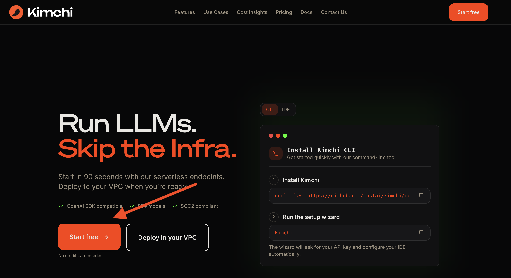

# Step 0: Getting Started - Kimchi CLI Setup

**Duration:** 5 minutes | **Difficulty:** Beginner

## Overview

Before starting any of the workshop riddles, you need to clone the workshop repository, set up the Kimchi CLI, and get your API key.

## Step 1: Clone the Workshop Repository

```bash
git clone https://github.com/castai/k8s-ai-workshop.git $HOME/workshop
```

## Step 2: Register on Kimchi

1. Open your browser and go to [https://kimchi.dev](https://kimchi.dev)
2. Click **Start free** to create your account
3. Complete the registration process

## Step 3: Get Your API Key

1. After logging in, navigate to the **Account** section in the left sidebar
2. Click **API Keys**
3. Create a new API key and copy it -- you will need it in the next step

## Step 4: Run Setup

```bash
$HOME/workshop/riddles/00-getting-started/setup.sh
```

The script will prompt you for the API key you copied in Step 3, then install and configure the Kimchi CLI and OpenCode automatically.

## Verify

Confirm everything is working:

```bash
kimchi --version
```

```bash
opencode --version
```

Both commands should return a version number without errors.

---

You are now ready to proceed to [Riddle 1: Advanced Cluster Debugging](../01-cluster-debugging/README.md).
