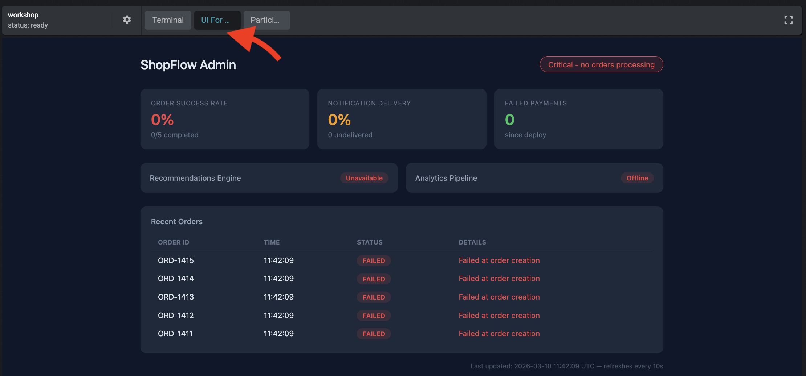

# Riddle 1: Advanced Cluster Debugging

| | |
|---|---|
| **Duration** | 45-60 minutes |
| **Difficulty** | Intermediate to Advanced |

## Riddle Overview

A microservices e-commerce backend has been deployed to the `riddle-1` namespace. The system is broken  - multiple services are failing and the application is not functional.

Your task: **investigate the cluster, find all the issues, and fix them.**

There are **8 real issues** across the services. The issues vary in nature and difficulty  - scheduling errors, RBAC misconfigurations, probe mismatches, resource constraints, and more. Some are straightforward, others require deeper investigation.

Be warned:
- **Not everything that looks broken is a root cause**  - some failures are caused by other failures (cascading). Fix the upstream issue and the downstream one resolves on its own.
- **Not everything that looks suspicious is actually broken**  - there are a few red herrings deployed alongside the real issues.
- **Some issues are only visible after you fix other issues first**  - fixing one problem may reveal a second problem on the same service.

## Architecture

The application is a simplified e-commerce backend called **ShopFlow**:

```
                         ┌──────────────┐
             :30001  →   │  api-gateway │
                         └──────┬───────┘
                                │
        ┌───────────┬───────────┼───────────┬──────────────┐
        ▼           ▼           ▼           ▼              ▼
 ┌─────────────┐ ┌──────────┐ ┌──────────┐ ┌────────────┐ ┌───────────┐
 │order-service│ │inventory-│ │search-   │ │notification│ │analytics- │
 │             │ │service   │ │service   │ │-service    │ │service    │
 └──────┬──────┘ └──────────┘ └─────┬────┘ └────────────┘ └───────────┘
        │                           │
        ▼                           ▼
 ┌──────────────┐           ┌──────────────────┐
 │payment-      │           │recommendation-   │
 │processor     │           │service           │
 └──────────────┘           └──────────────────┘

   Infrastructure: cache-service, config-service, logging-service
```

| Service | Role |
|---------|------|
| **api-gateway** | Entry point. Hosts the ShopFlow admin dashboard. NodePort 30001. |
| **order-service** | Handles order creation and lifecycle. |
| **payment-processor** | Processes payments for completed orders. |
| **inventory-service** | Tracks product stock levels. Reads config from the cluster. |
| **search-service** | Product search and catalog validation. |
| **recommendation-service** | Personalized product recommendations. |
| **notification-service** | Sends order confirmations to customers. |
| **analytics-service** | Collects usage metrics and business analytics. |
| **cache/config/logging** | Infrastructure services supporting the backend. |

## Setup

```bash
$HOME/workshop/riddles/01-cluster-debugging/setup.sh
```

## Getting Started

After running setup, open the ShopFlow Admin dashboard via the **"UI For..."** tab in the Lab web terminal:



The dashboard shows live order processing status and will reflect your progress as you fix issues.

## Where to Start

1. Get a broad overview of the namespace: `kubectl get all -n riddle-1`
2. Look for pods that aren't in a healthy Running/Ready state
3. Use `kubectl describe` and `kubectl logs` to investigate
4. Think about dependencies between services  - fix upstream issues first

## Verification

```bash
$HOME/workshop/riddles/01-cluster-debugging/verify.sh
```

All 10 checks must pass to complete the riddle.

## Hints

If you get stuck, check the **"Riddle 1: Hints"** tab in the exercise sidebar for progressive hints (3 levels per issue  - try to solve it yourself before peeking).
